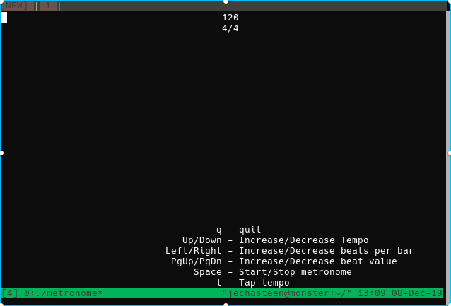

# Metronome

A dead-simple ncurses metronome.

build: `g++ -lncurses -o metronome main.cpp` or `make`

run: `metronome $TEMPO $BEATS_PER_BAR $BEAT_VALUE` e.g. `./metronome 120 4 4`

Note: The sound files are hard coded defines, change these if you don't have `hydrogen` installed.

The included beep sound effect `beep.wav` was created by [Mike Koenig](http://soundbible.com/1251-Beep.html)
