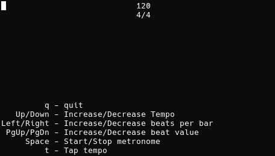

# Metronome

A dead-simple ncurses metronome.

build: `g++ -lncurses -o metronome main.cpp` or `make`

run: `metronome $TEMPO $BEATS_PER_BAR $BEAT_VALUE`
e.g. `./metronome 120 4 4` -or- `./metronome`

Note: The metronome is configured to use .wav files from the hydrogen drum machine.
If hydrogen is not installed it will use the included beep.wav

The included beep sound effect `beep.wav` was created by [Mike Koenig](http://soundbible.com/1251-Beep.html)
